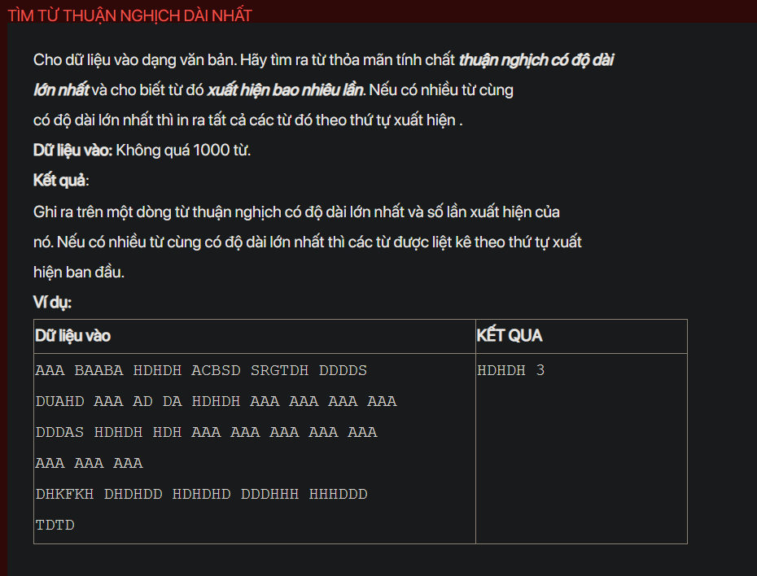

## J03020

- [CompareByLength.class](CompareByLength.class)
- [input.txt](input.txt)
- [J03020.class](J03020.class)
- [J03020.java](J03020.java)
- [output.txt](output.txt)
- [README.md](README.md)
- [Word.class](Word.class)
- [Word.java](Word.java)
