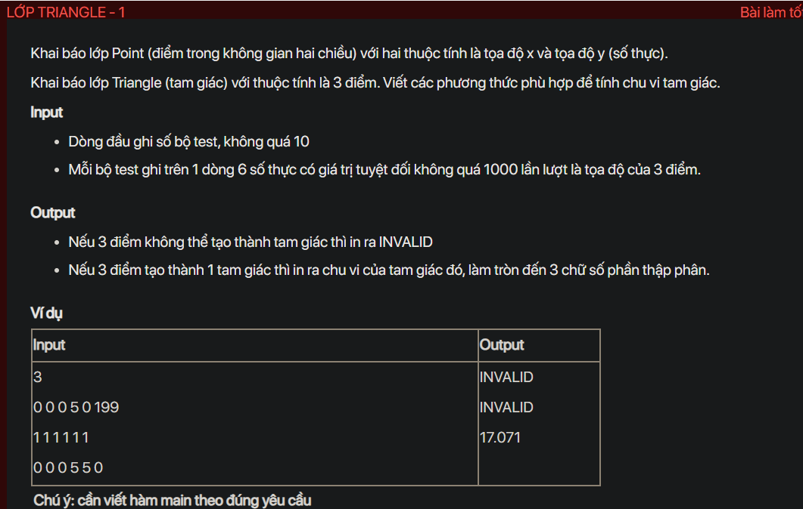
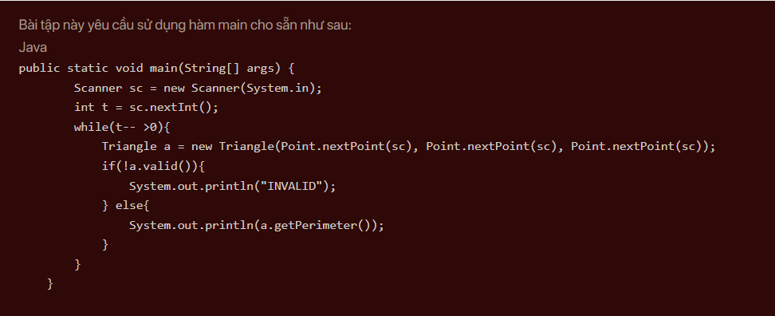

## J04019

- [Edge.class](Edge.class)
- [Edge.java](Edge.java)
- [image-1.png](image-1.png)
- [image.png](image.png)
- [input.txt](input.txt)
- [J04019.class](J04019.class)
- [J04019.java](J04019.java)
- [output.txt](output.txt)
- [Point.class](Point.class)
- [Point.java](Point.java)
- [README.md](README.md)
- [Triangle.class](Triangle.class)
- [Triangle.java](Triangle.java)
