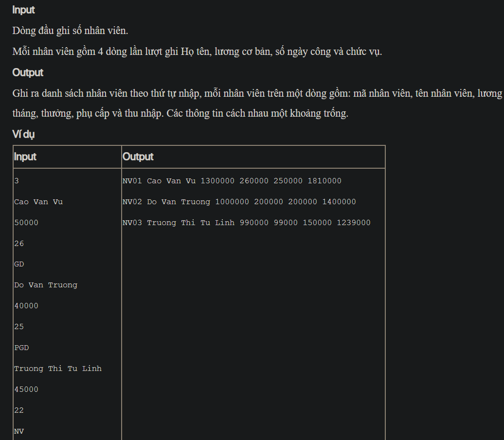

## J05040

- [Employee.class](Employee.class)
- [Employee.java](Employee.java)
- [input.txt](input.txt)
- [J05040.class](J05040.class)
- [J05040.java](J05040.java)
- [output.txt](output.txt)
- [README.md](README.md)
