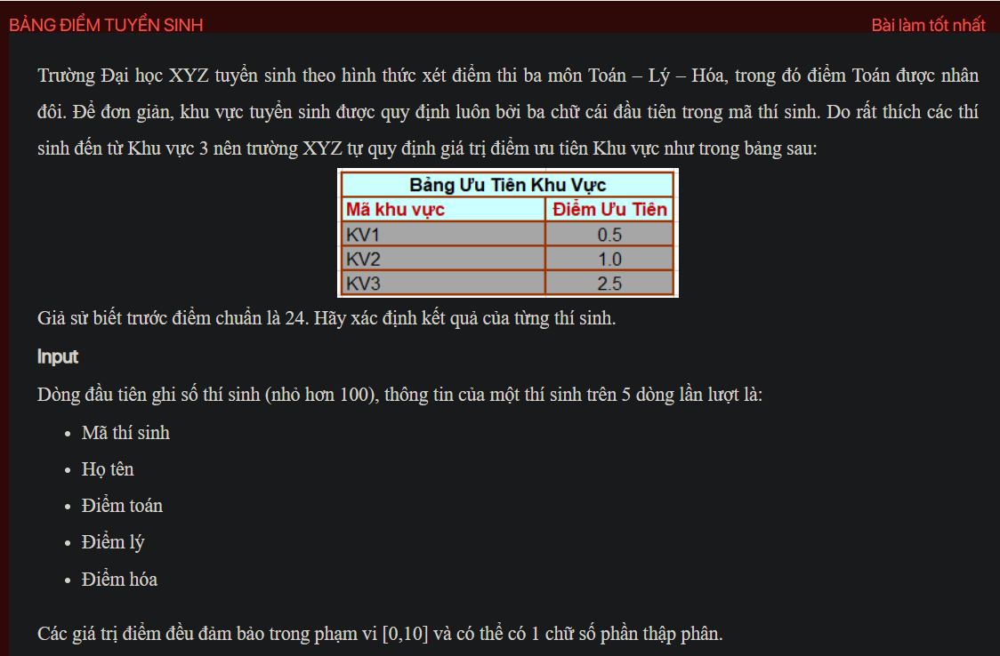
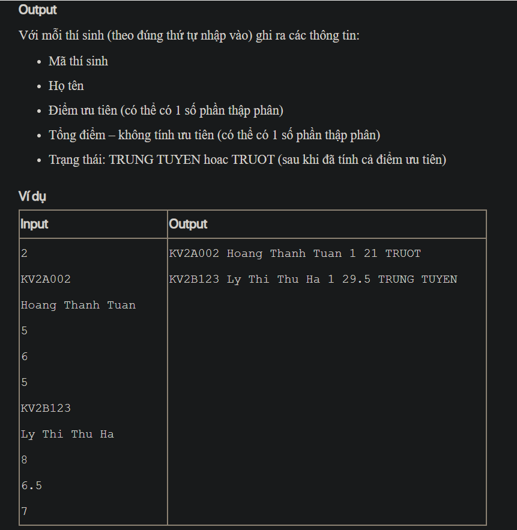

## J05057

- [Contestant.class](Contestant.class)
- [Contestant.java](Contestant.java)
- [input.txt](input.txt)
- [J05057.class](J05057.class)
- [J05057.java](J05057.java)
- [output.txt](output.txt)
- [README.md](README.md)
