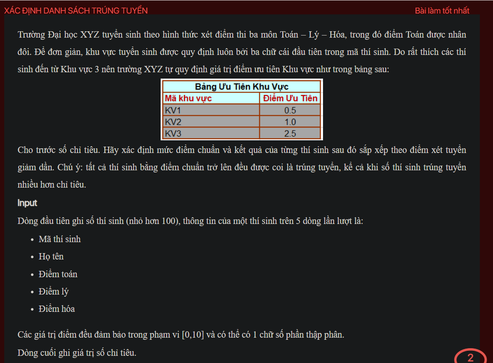
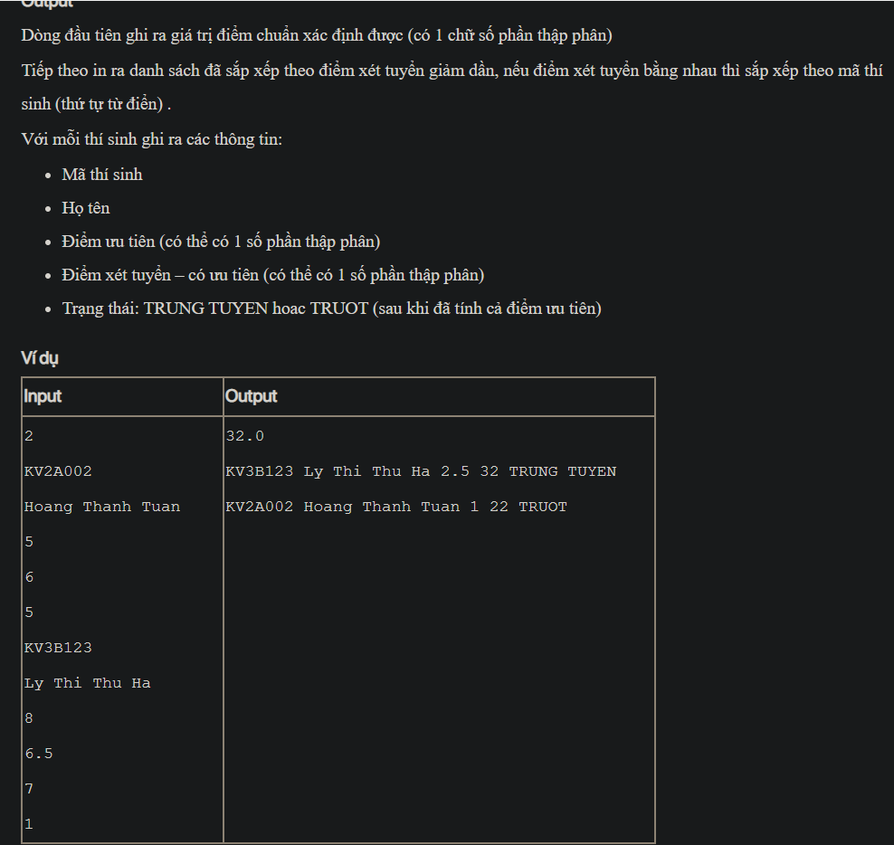

## J05059

- [CompareByTotalScoreAndId.class](CompareByTotalScoreAndId.class)
- [Contestant.class](Contestant.class)
- [Contestant.java](Contestant.java)
- [image-1.png](image-1.png)
- [image.png](image.png)
- [input.txt](input.txt)
- [J05059.class](J05059.class)
- [J05059.java](J05059.java)
- [output.txt](output.txt)
- [README.md](README.md)
