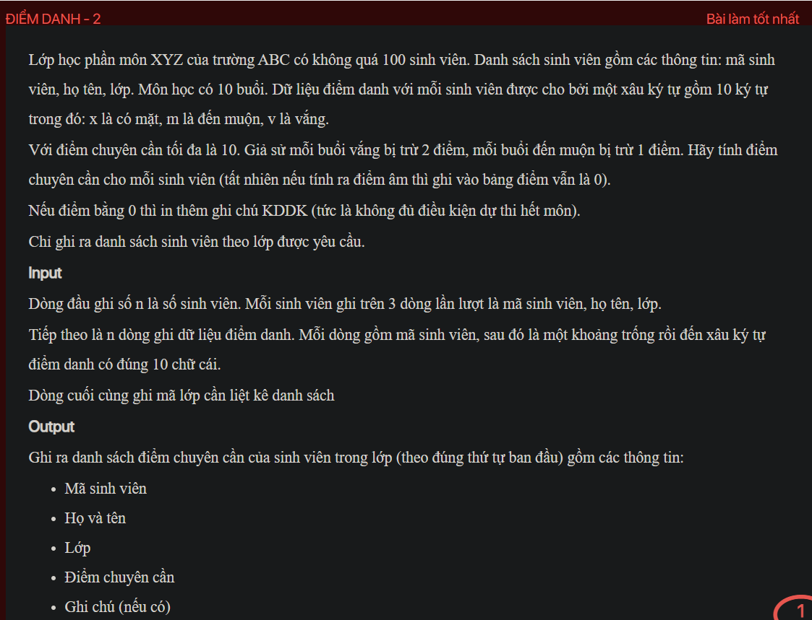
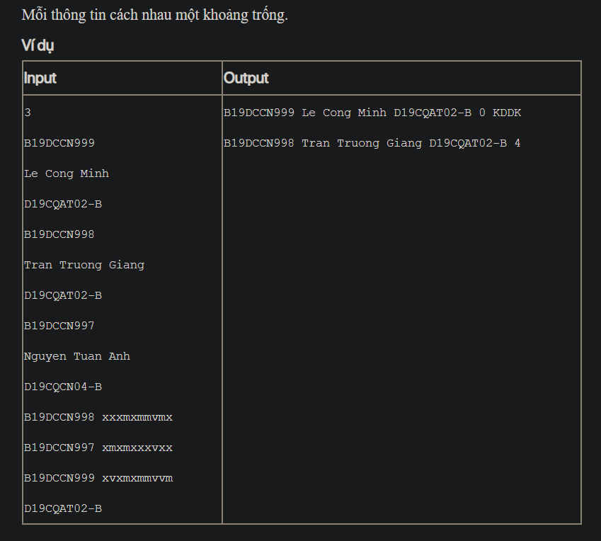

## J05075

- [input.txt](input.txt)
- [J05075.class](J05075.class)
- [J05075.java](J05075.java)
- [output.txt](output.txt)
- [README.md](README.md)
- [Student.class](Student.class)
- [Student.java](Student.java)
