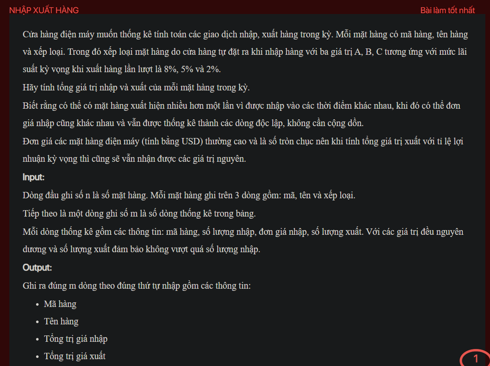
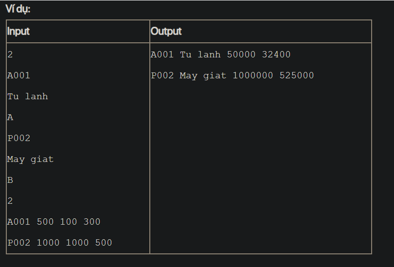

## J05076

- [Bill.class](Bill.class)
- [Bill.java](Bill.java)
- [image-1.png](image-1.png)
- [image.png](image.png)
- [input.txt](input.txt)
- [J05076.class](J05076.class)
- [J05076.java](J05076.java)
- [output.txt](output.txt)
- [Product.class](Product.class)
- [Product.java](Product.java)
- [README.md](README.md)
