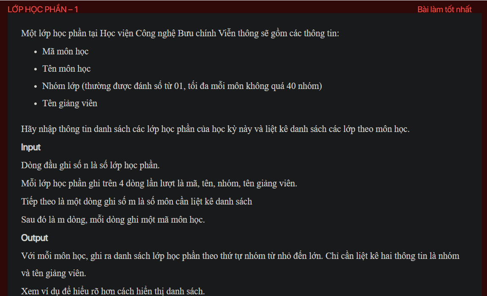

## J05079

- [Course.class](Course.class)
- [Course.java](Course.java)
- [image.png](image.png)
- [input.txt](input.txt)
- [J05079.class](J05079.class)
- [J05079.java](J05079.java)
- [output.txt](output.txt)
- [README.md](README.md)
