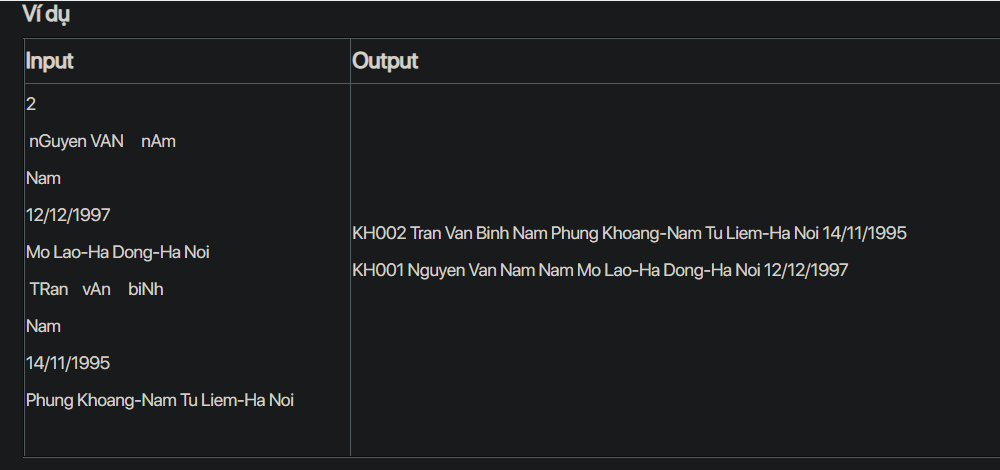

## J05082

- [Customer.class](Customer.class)
- [Customer.java](Customer.java)
- [input.txt](input.txt)
- [J05082.class](J05082.class)
- [J05082.java](J05082.java)
- [output.txt](output.txt)
- [README.md](README.md)
