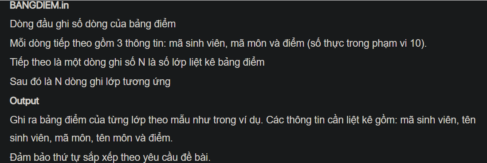

## J07036

- [BANGDIEM.in](BANGDIEM.in)
- [CompareByCourseIdAndStudentId.class](CompareByCourseIdAndStudentId.class)
- [Course.class](Course.class)
- [Course.java](Course.java)
- [image-1.png](image-1.png)
- [image-2.png](image-2.png)
- [image.png](image.png)
- [input.txt](input.txt)
- [J07036.class](J07036.class)
- [J07036.java](J07036.java)
- [MONHOC.in](MONHOC.in)
- [output.txt](output.txt)
- [README.md](README.md)
- [SINHVIEN.in](SINHVIEN.in)
- [Student.class](Student.class)
- [Student.java](Student.java)
- [Transcript.class](Transcript.class)
- [Transcript.java](Transcript.java)
