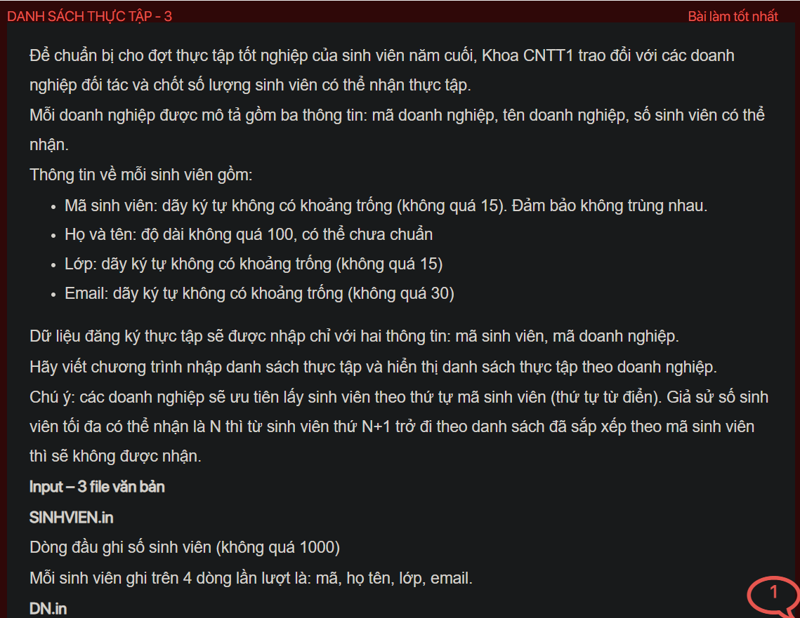
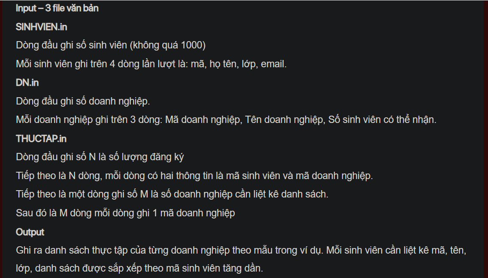
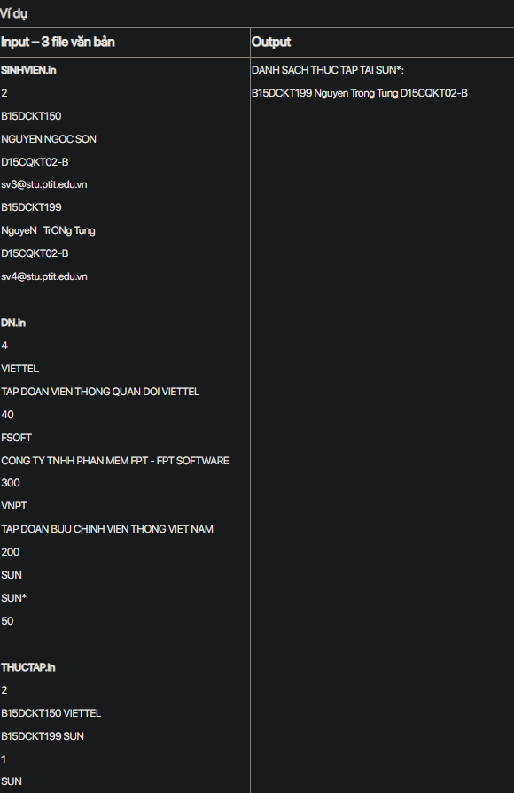

## J07038

- [Company.class](Company.class)
- [Company.java](Company.java)
- [CompareById.class](CompareById.class)
- [DN.in](DN.in)
- [input.txt](input.txt)
- [J07038.class](J07038.class)
- [J07038.java](J07038.java)
- [output.txt](output.txt)
- [README.md](README.md)
- [SINHVIEN.in](SINHVIEN.in)
- [Student.class](Student.class)
- [Student.java](Student.java)
- [THUCTAP.in](THUCTAP.in)
