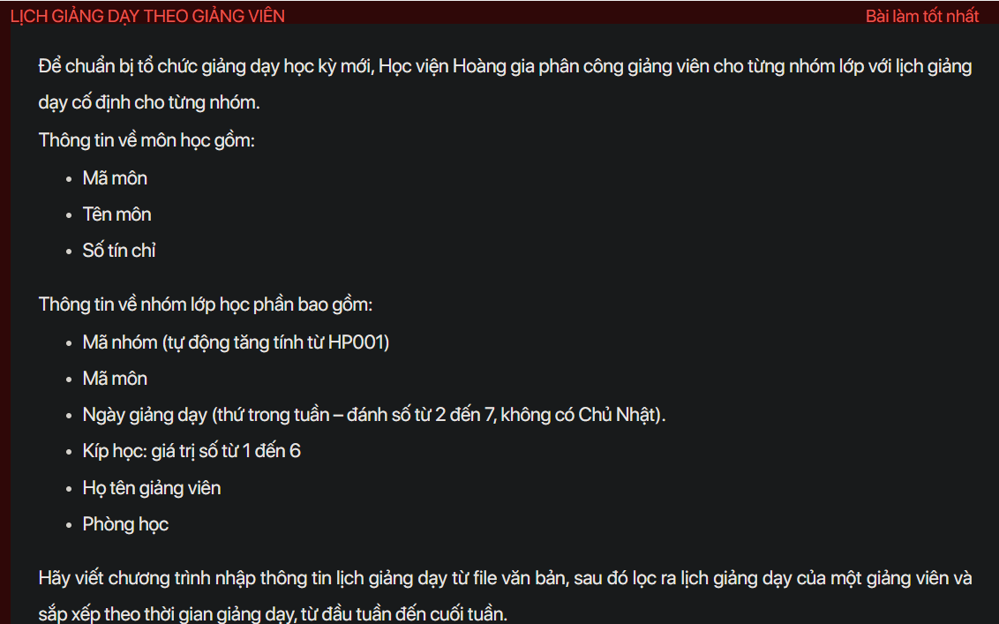
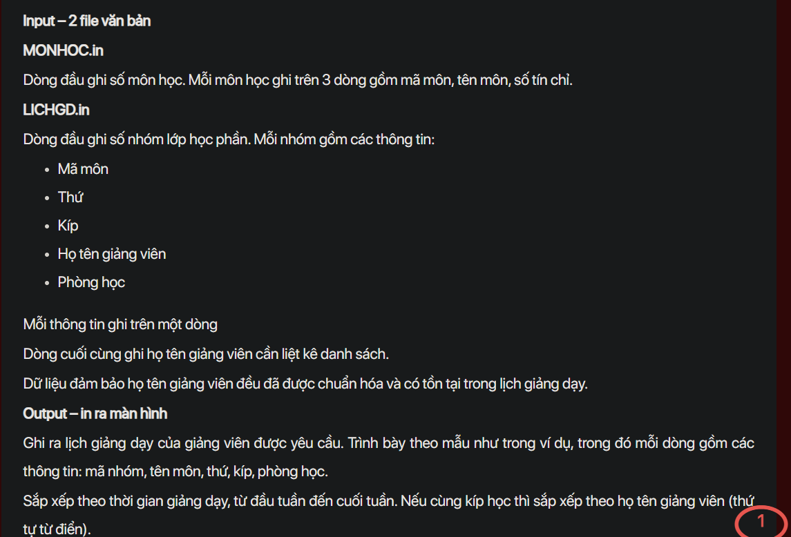
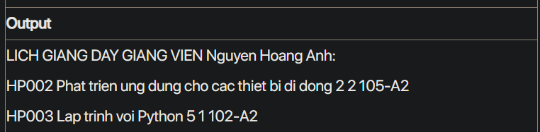

## J07075

- [CompareByTimeAndLectureName.class](CompareByTimeAndLectureName.class)
- [Course.class](Course.class)
- [Course.java](Course.java)
- [input.txt](input.txt)
- [J07075.class](J07075.class)
- [J07075.java](J07075.java)
- [LICHGD.in](LICHGD.in)
- [MONHOC.in](MONHOC.in)
- [output.txt](output.txt)
- [README.md](README.md)
- [Section.class](Section.class)
- [Section.java](Section.java)
