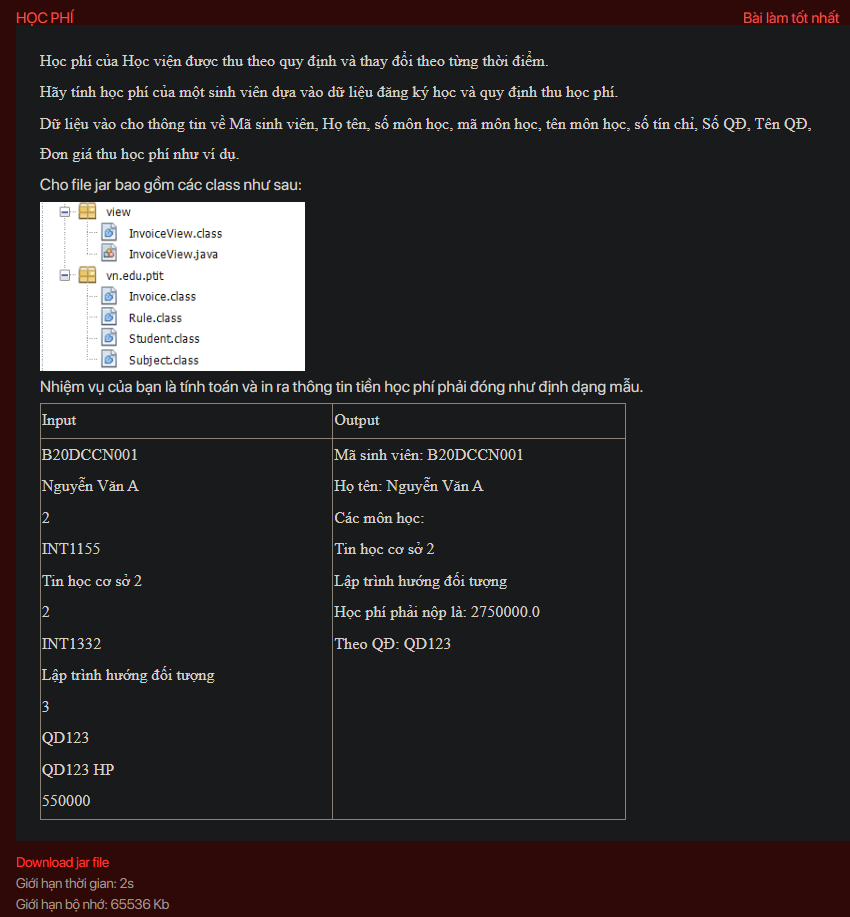

## ./hellojar

- [hellojar.class](hellojar.class)
- [HELLOJAR.jar](HELLOJAR.jar)
- [hellojar.java](hellojar.java)
- [image.png](image.png)
- [input.txt](input.txt)
- [output.txt](output.txt)
- [PaymentController.class](PaymentController.class)
- [README.md](README.md)
