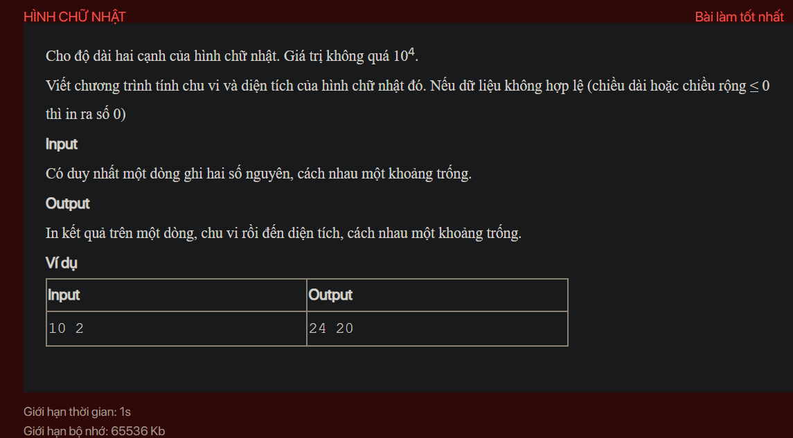

## ./j01001

- [image.png](image.png)
- [input.txt](input.txt)
- [j01001.class](j01001.class)
- [j01001.java](j01001.java)
- [output.txt](output.txt)
- [README.md](README.md)
- [Rectangle.class](Rectangle.class)
- [Rectangle.java](Rectangle.java)
