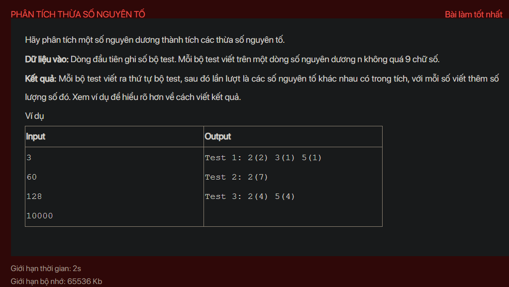

## ./j01008

- [image.png](image.png)
- [input.txt](input.txt)
- [j01008.class](j01008.class)
- [j01008.java](j01008.java)
- [output.txt](output.txt)
- [README.md](README.md)
- [TestCase.class](TestCase.class)
- [TestCase.java](TestCase.java)
