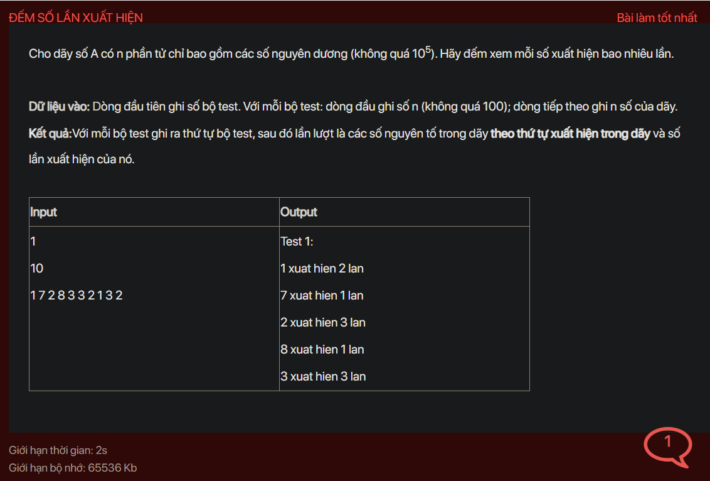

## ./j02007

- [input.txt](input.txt)
- [j02007.class](j02007.class)
- [j02007.java](j02007.java)
- [output.txt](output.txt)
- [README.md](README.md)
- [TestCase.class](TestCase.class)
- [TestCase.java](TestCase.java)
