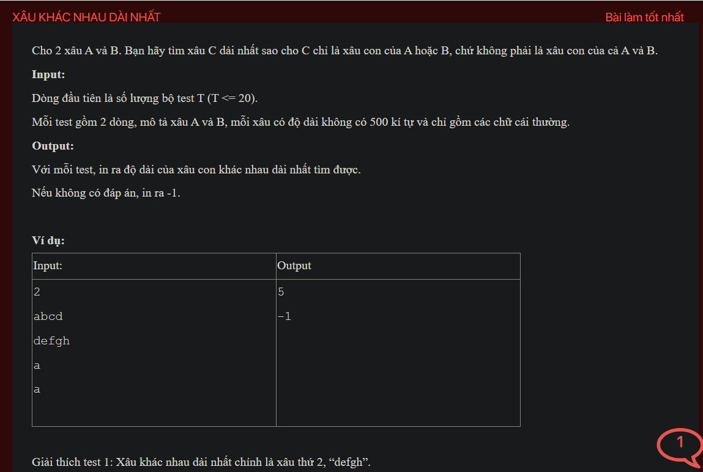

## j03026
## ./j03026


- [input.txt](input.txt)
- [j03026.class](j03026.class)
- [j03026.java](j03026.java)
- [output.txt](output.txt)
- [README.md](README.md)


### Note
change from 
```java
if (n == m) {
    System.out.println("-1");
    return;
}
```
to 
```java
if (a.equals(b)) {
    System.out.println("-1");
    return;
}
```