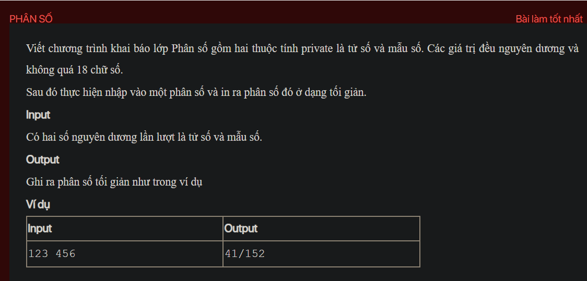

## ./j04003

- [Fraction.class](Fraction.class)
- [Fraction.java](Fraction.java)
- [input.txt](input.txt)
- [j04003.class](j04003.class)
- [j04003.java](j04003.java)
- [j04003.mdj](j04003.mdj)
- [Main.jpg](Main.jpg)
- [output.txt](output.txt)
- [README.md](README.md)
