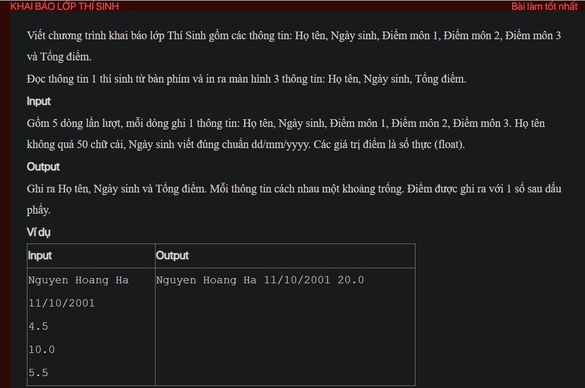

## ./j04005

- [Contestant.class](Contestant.class)
- [Contestant.java](Contestant.java)
- [input.txt](input.txt)
- [j04005.class](j04005.class)
- [j04005.java](j04005.java)
- [j04005.mdj](j04005.mdj)
- [Main.jpg](Main.jpg)
- [output.txt](output.txt)
- [README.md](README.md)
