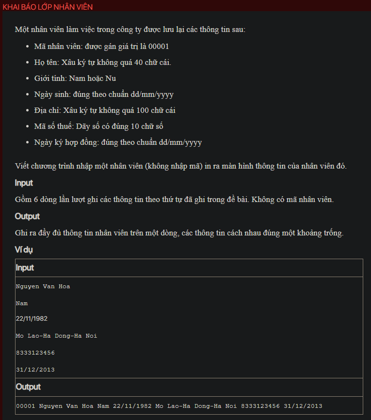

## ./j04007

- [Employee.class](Employee.class)
- [Employee.java](Employee.java)
- [input.txt](input.txt)
- [j04007.class](j04007.class)
- [j04007.java](j04007.java)
- [j04007.mdj](j04007.mdj)
- [Main.jpg](Main.jpg)
- [output.txt](output.txt)
- [README.md](README.md)
