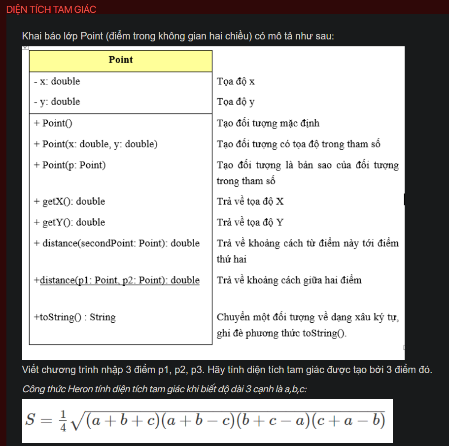
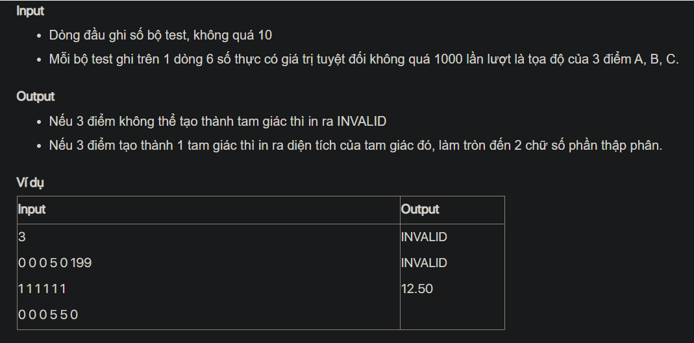

## ./j04009

- [Edge.class](Edge.class)
- [Edge.java](Edge.java)
- [input.txt](input.txt)
- [j04009.class](j04009.class)
- [j04009.java](j04009.java)
- [j04009.mdj](j04009.mdj)
- [Main.jpg](Main.jpg)
- [output.txt](output.txt)
- [Point.class](Point.class)
- [Point.java](Point.java)
- [README.md](README.md)
- [Triangle.class](Triangle.class)
- [Triangle.java](Triangle.java)
