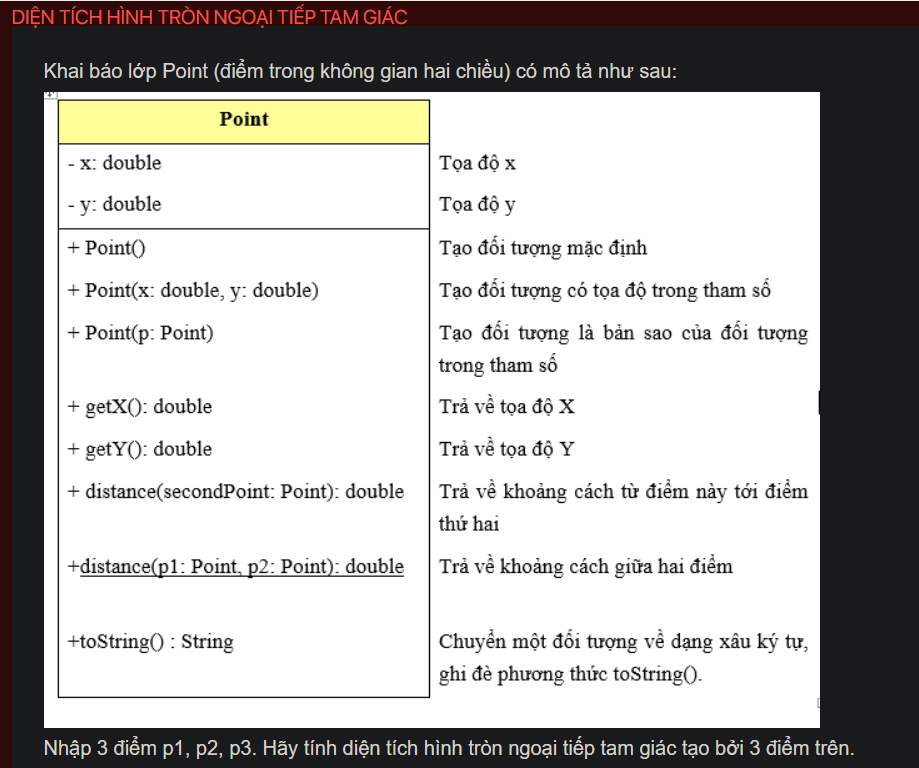

## ./j04010

- [Edge.class](Edge.class)
- [Edge.java](Edge.java)
- [input.txt](input.txt)
- [j04010.class](j04010.class)
- [j04010.java](j04010.java)
- [j04010.mdj](j04010.mdj)
- [Main.jpg](Main.jpg)
- [output.txt](output.txt)
- [Point.class](Point.class)
- [Point.java](Point.java)
- [README.md](README.md)
- [Triangle.class](Triangle.class)
- [Triangle.java](Triangle.java)
