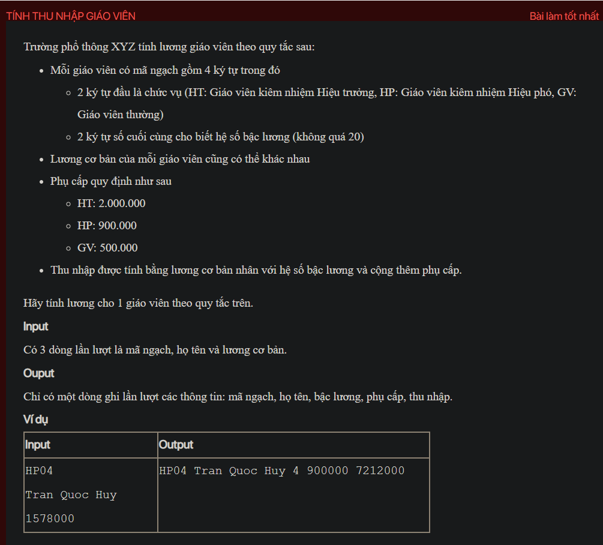

## ./j04015

- [input.txt](input.txt)
- [j04015.class](j04015.class)
- [j04015.java](j04015.java)
- [j04015.mdj](j04015.mdj)
- [Main.jpg](Main.jpg)
- [output.txt](output.txt)
- [README.md](README.md)
- [Teacher.class](Teacher.class)
- [Teacher.java](Teacher.java)
