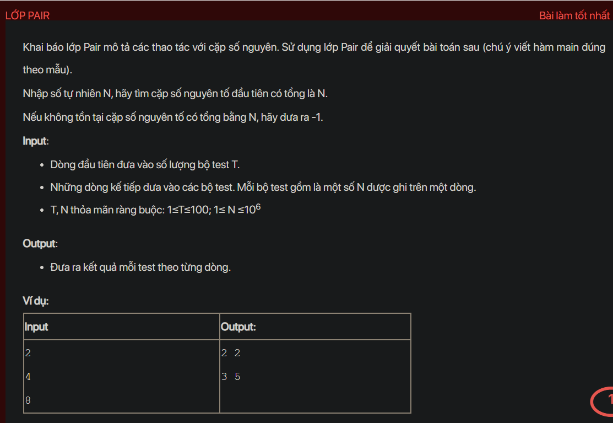

## ./j04020

- [input.txt](input.txt)
- [j04020.class](j04020.class)
- [j04020.java](j04020.java)
- [j04020.mdj](j04020.mdj)
- [Main.jpg](Main.jpg)
- [output.txt](output.txt)
- [Pair.class](Pair.class)
- [Pair.java](Pair.java)
- [README.md](README.md)
