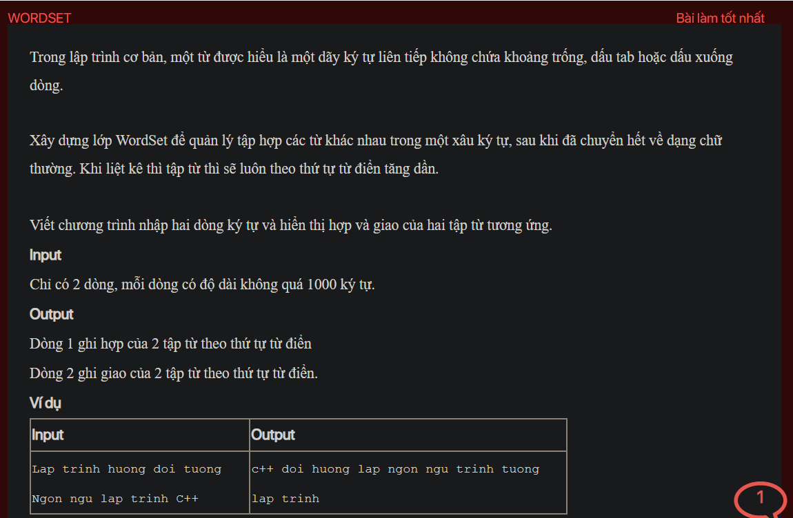

## ./j04022

```java
public static void main(String[] args) {
    Scanner in = new Scanner(System.in);
    WordSet s1 = new WordSet(in.nextLine());
    WordSet s2 = new WordSet(in.nextLine());
    System.out.println(s1.union(s2));
    System.out.println(s1.intersection(s2));
}
```
- [input.txt](input.txt)
- [j04022.class](j04022.class)
- [j04022.java](j04022.java)
- [j04022.mdj](j04022.mdj)
- [Main.jpg](Main.jpg)
- [output.txt](output.txt)
- [README.md](README.md)
- [WordSet.class](WordSet.class)
- [WordSet.java](WordSet.java)
