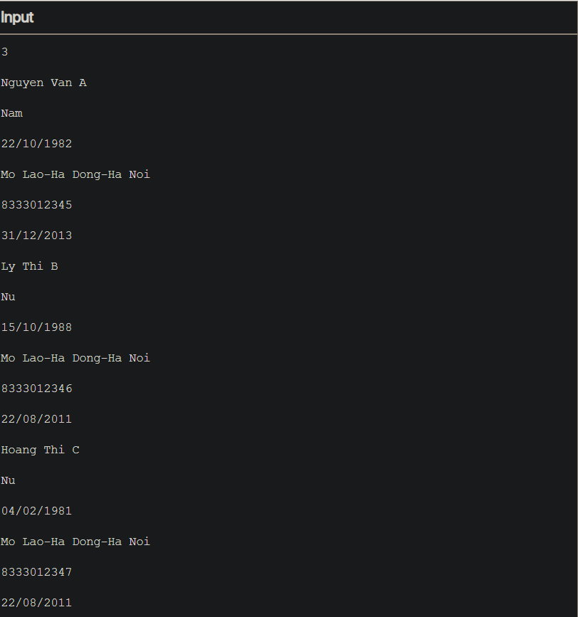
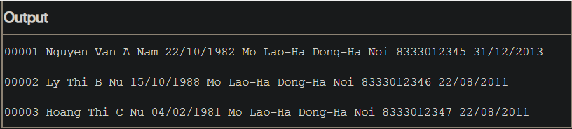

## ./j05006

- [Employee.class](Employee.class)
- [Employee.java](Employee.java)
- [input.txt](input.txt)
- [j05006.class](j05006.class)
- [j05006.java](j05006.java)
- [j05006.mdj](j05006.mdj)
- [Main.jpg](Main.jpg)
- [output.txt](output.txt)
- [README.md](README.md)
