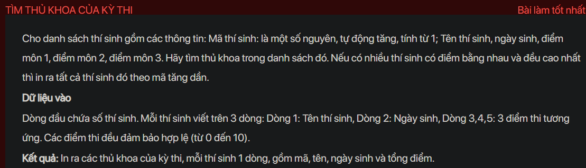
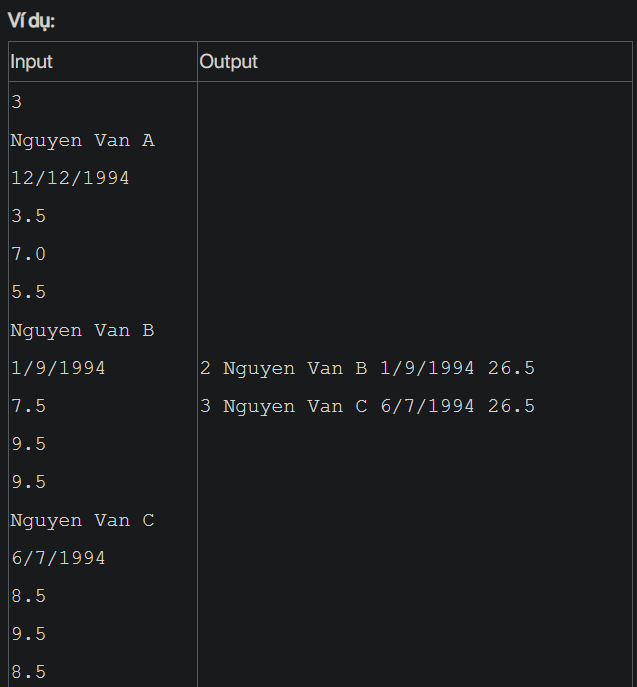

## ./j05009

- [Contestant$1.class](Contestant$1.class)
- [Contestant.class](Contestant.class)
- [Contestant.java](Contestant.java)
- [input.txt](input.txt)
- [j05009.class](j05009.class)
- [j05009.java](j05009.java)
- [j05009.mdj](j05009.mdj)
- [Main.jpg](Main.jpg)
- [output.txt](output.txt)
- [README.md](README.md)
