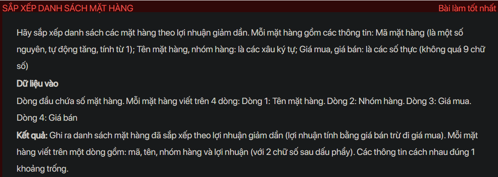
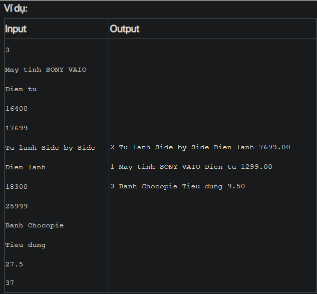

## ./j05010

- [input.txt](input.txt)
- [Item.class](Item.class)
- [Item.java](Item.java)
- [j05010.class](j05010.class)
- [j05010.java](j05010.java)
- [j05010.mdj](j05010.mdj)
- [Main.jpg](Main.jpg)
- [output.txt](output.txt)
- [README.md](README.md)
