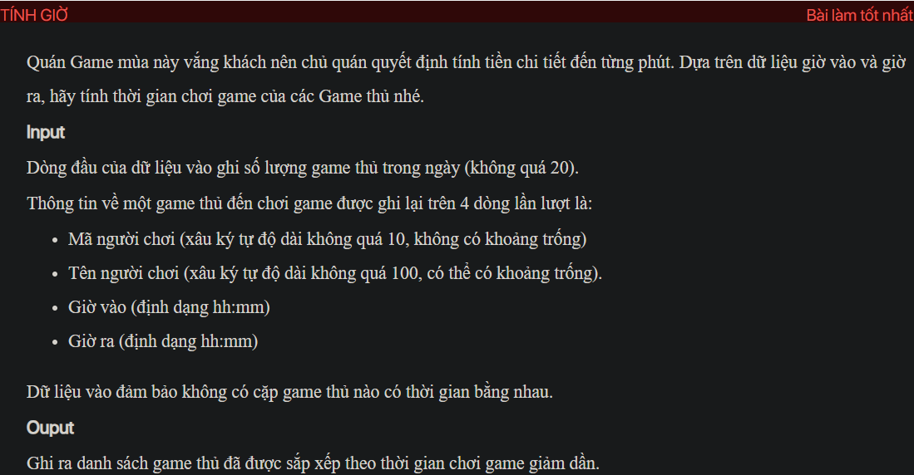
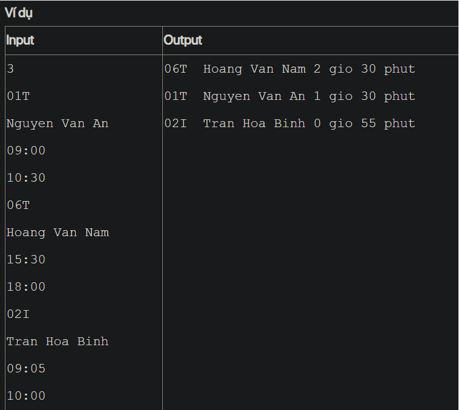

## j05011
## ./j05011

- [Gamer$1.class](Gamer$1.class)
- [Gamer.class](Gamer.class)
- [Gamer.java](Gamer.java)
- [image-1.png](image-1.png)
- [image.png](image.png)
- [input.txt](input.txt)
- [j05011.class](j05011.class)
- [j05011.java](j05011.java)
- [j05011.mdj](j05011.mdj)
- [Main.jpg](Main.jpg)
- [output.txt](output.txt)
- [README.md](README.md)
- [Time.class](Time.class)
- [Time.java](Time.java)
