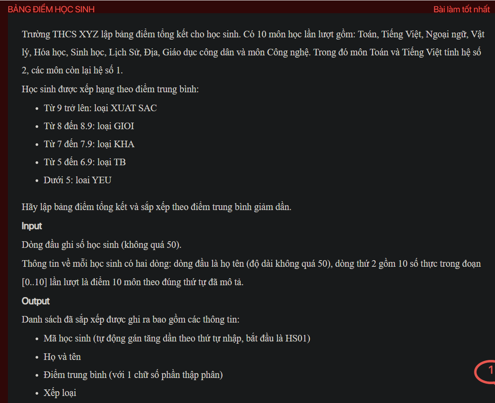

## ./j05018

- [CompareByAvgScoreAndId.class](CompareByAvgScoreAndId.class)
- [input.txt](input.txt)
- [j05018.class](j05018.class)
- [j05018.java](j05018.java)
- [j05018.mdj](j05018.mdj)
- [Main.jpg](Main.jpg)
- [output.txt](output.txt)
- [README.md](README.md)
- [Score.class](Score.class)
- [Score.java](Score.java)
- [Student.class](Student.class)
- [Student.java](Student.java)
