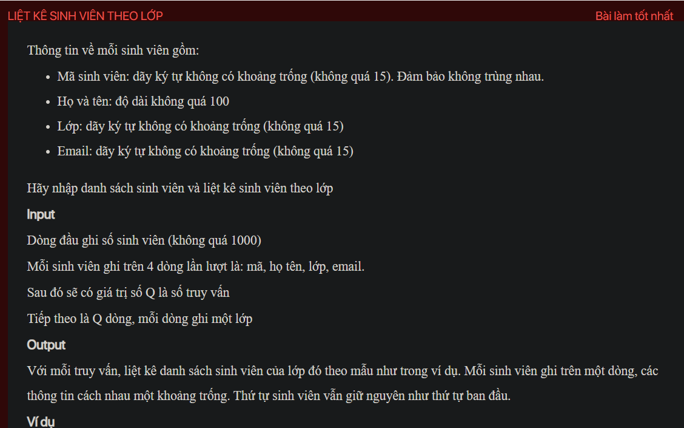
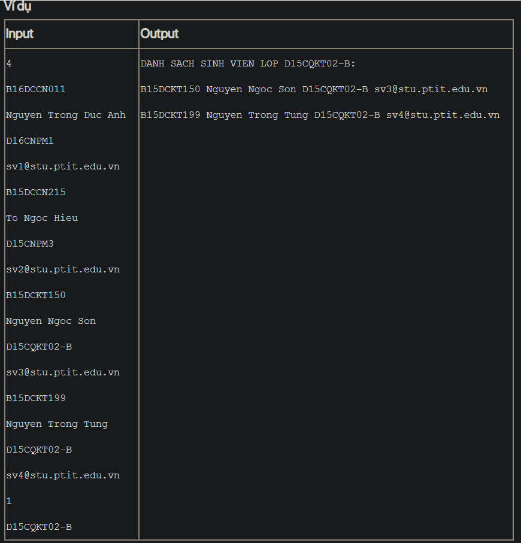

## ./j05022

- [input.txt](input.txt)
- [j05022.class](j05022.class)
- [j05022.java](j05022.java)
- [j05022.mdj](j05022.mdj)
- [Main.jpg](Main.jpg)
- [output.txt](output.txt)
- [README.md](README.md)
- [Student.class](Student.class)
- [Student.java](Student.java)
