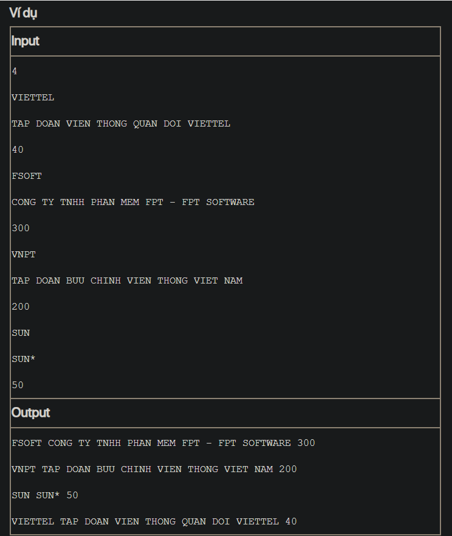

## j05028
## ./j05028

- [Enterprise.java](Enterprise.java)
- [image-1.png](image-1.png)
- [image.png](image.png)
- [input.txt](input.txt)
- [j05028.java](j05028.java)
- [j05028.mdj](j05028.mdj)
- [Main.jpg](Main.jpg)
- [output.txt](output.txt)
- [README.md](README.md)
