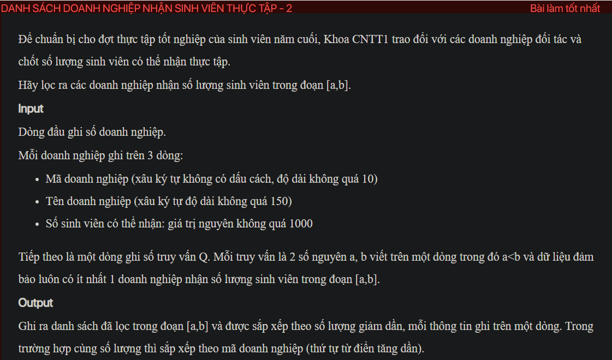

## ./j05029

- [CompareByCapacityAndId.class](CompareByCapacityAndId.class)
- [Enterprise.class](Enterprise.class)
- [Enterprise.java](Enterprise.java)
- [input.txt](input.txt)
- [j05029.class](j05029.class)
- [j05029.java](j05029.java)
- [j05029.mdj](j05029.mdj)
- [Main.jpg](Main.jpg)
- [output.txt](output.txt)
- [README.md](README.md)
