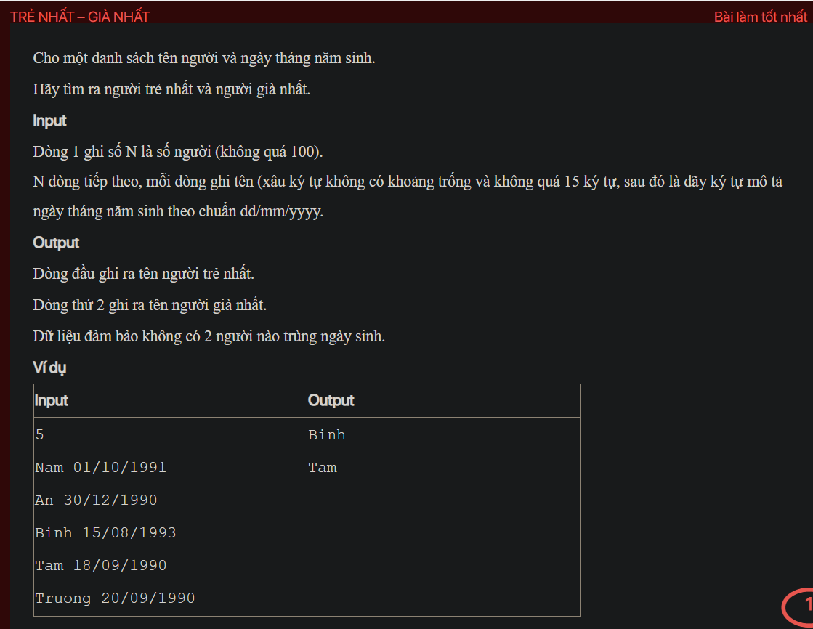

## ./j05032

- [CompareByAge.class](CompareByAge.class)
- [input.txt](input.txt)
- [j05032.class](j05032.class)
- [j05032.java](j05032.java)
- [j05032.mdj](j05032.mdj)
- [Main.jpg](Main.jpg)
- [MyDate.class](MyDate.class)
- [MyDate.java](MyDate.java)
- [output.txt](output.txt)
- [Person.class](Person.class)
- [Person.java](Person.java)
- [README.md](README.md)
