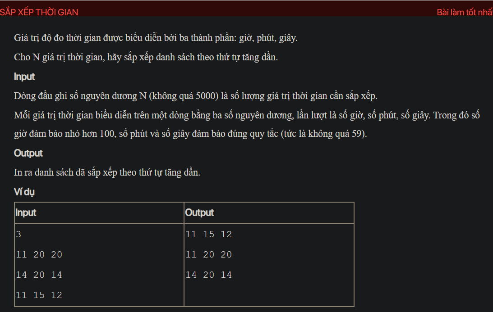

## ./j05033

- [CompareByTime.class](CompareByTime.class)
- [input.txt](input.txt)
- [j05033.class](j05033.class)
- [j05033.java](j05033.java)
- [j05033.mdj](j05033.mdj)
- [Main.jpg](Main.jpg)
- [output.txt](output.txt)
- [README.md](README.md)
- [Time.class](Time.class)
- [Time.java](Time.java)
