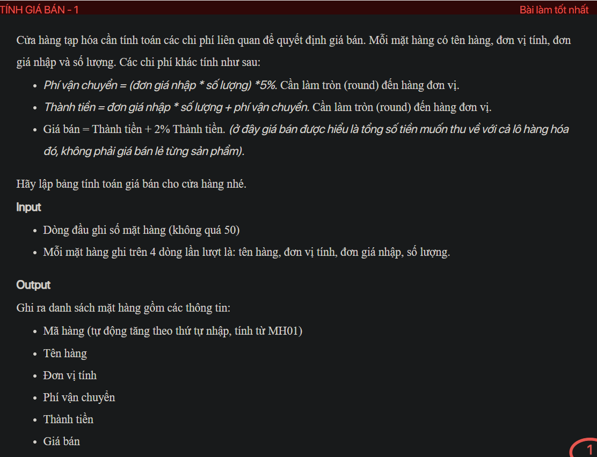
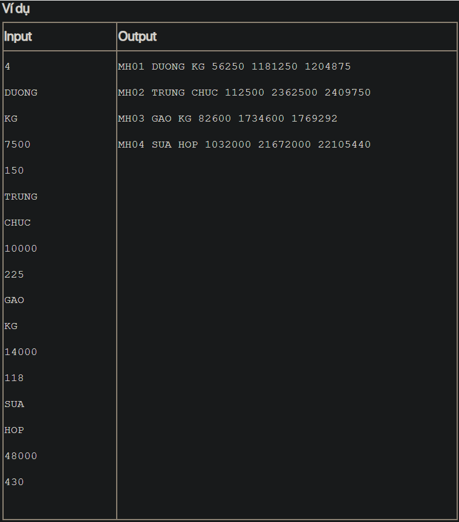

## ./j05036

- [input.txt](input.txt)
- [j05036.class](j05036.class)
- [j05036.java](j05036.java)
- [j05036.mdj](j05036.mdj)
- [Main.jpg](Main.jpg)
- [output.txt](output.txt)
- [Product.class](Product.class)
- [Product.java](Product.java)
- [README.md](README.md)
