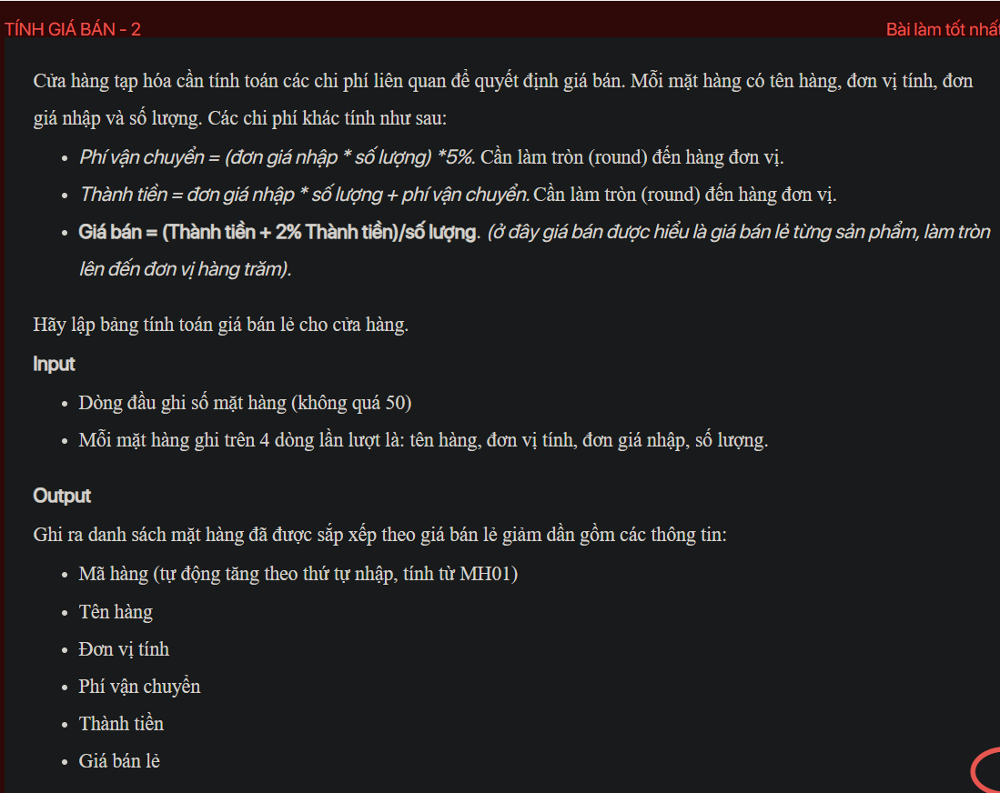

## ./j05037

- [CompareByTotalPrice.class](CompareByTotalPrice.class)
- [input.txt](input.txt)
- [j05037.class](j05037.class)
- [j05037.java](j05037.java)
- [j05037.mdj](j05037.mdj)
- [Main.jpg](Main.jpg)
- [output.txt](output.txt)
- [Product.class](Product.class)
- [Product.java](Product.java)
- [README.md](README.md)
