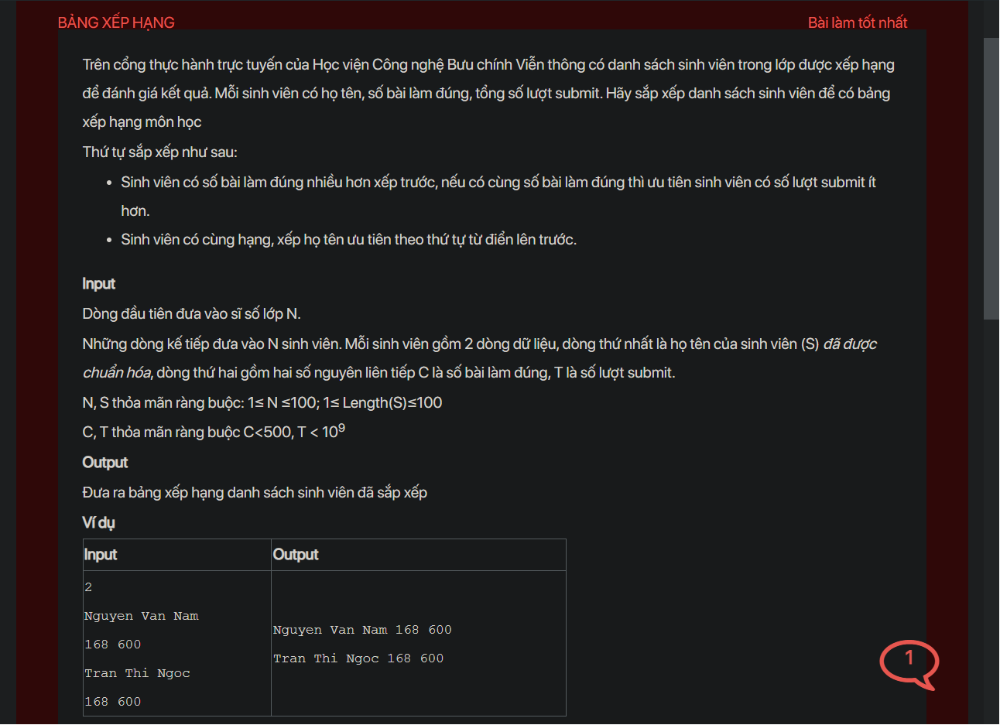

## j05042
## ./j05042

- [image.png](image.png)
- [input.txt](input.txt)
- [j05042.java](j05042.java)
- [j05042.mdj](j05042.mdj)
- [Main.jpg](Main.jpg)
- [output.txt](output.txt)
- [README.md](README.md)
- [Student.java](Student.java)
