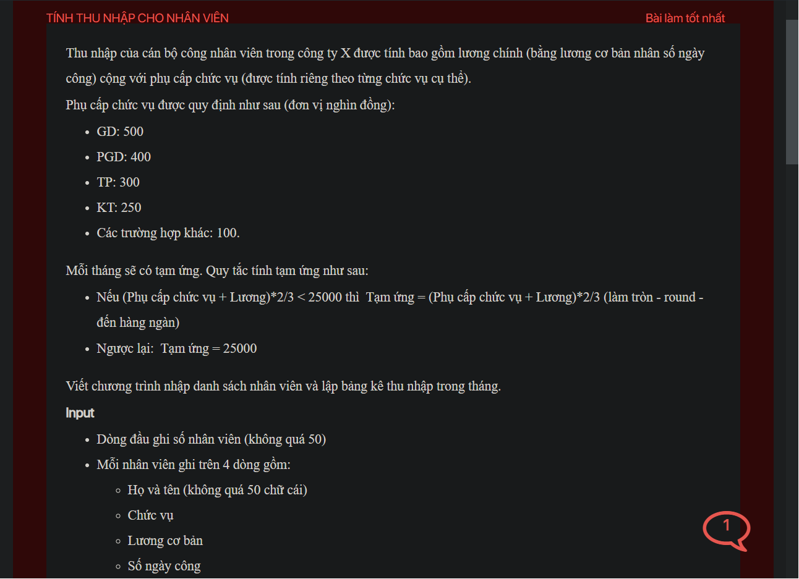

## ./j05043

- [Employee.class](Employee.class)
- [Employee.java](Employee.java)
- [input.txt](input.txt)
- [j05043.class](j05043.class)
- [j05043.java](j05043.java)
- [j05043.mdj](j05043.mdj)
- [Main.jpg](Main.jpg)
- [output.txt](output.txt)
- [README.md](README.md)
