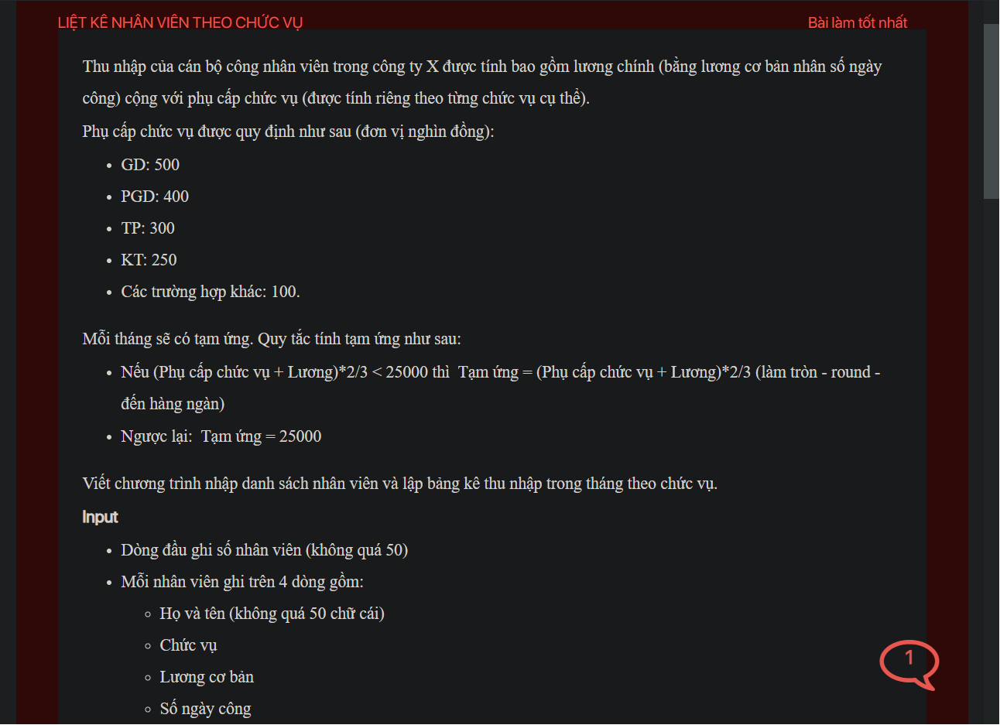

## ./j05044

- [Employee.class](Employee.class)
- [Employee.java](Employee.java)
- [input.txt](input.txt)
- [j05044.class](j05044.class)
- [j05044.java](j05044.java)
- [j05044.mdj](j05044.mdj)
- [Main.jpg](Main.jpg)
- [output.txt](output.txt)
- [README.md](README.md)
