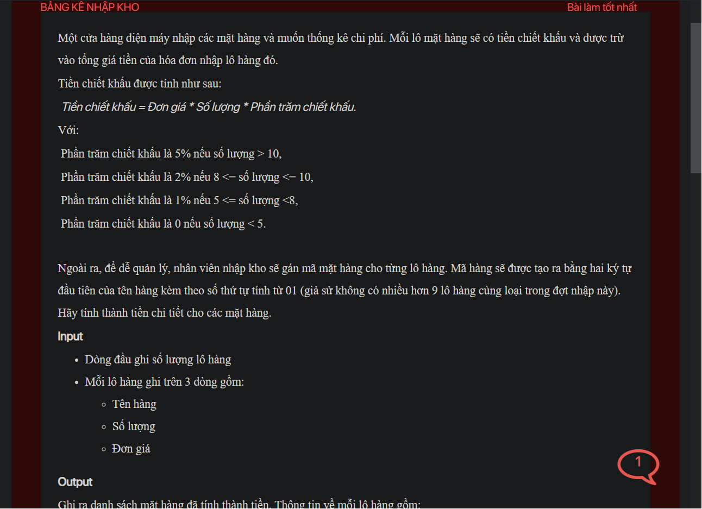

## ./j05046

- [input.txt](input.txt)
- [j05046.class](j05046.class)
- [j05046.java](j05046.java)
- [j05046.mdj](j05046.mdj)
- [Load.class](Load.class)
- [Load.java](Load.java)
- [Main.jpg](Main.jpg)
- [output.txt](output.txt)
- [README.md](README.md)
