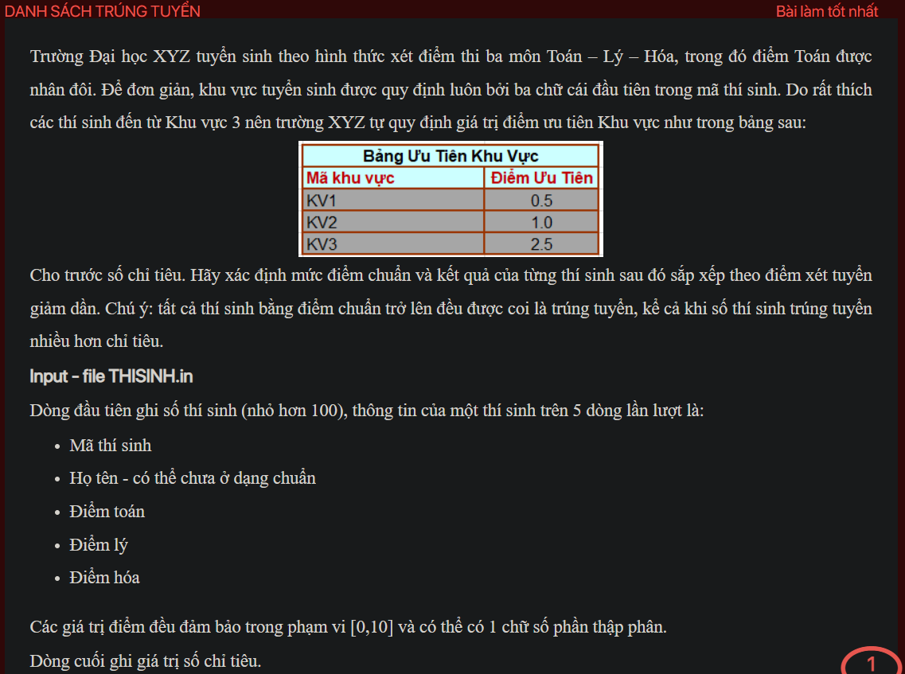
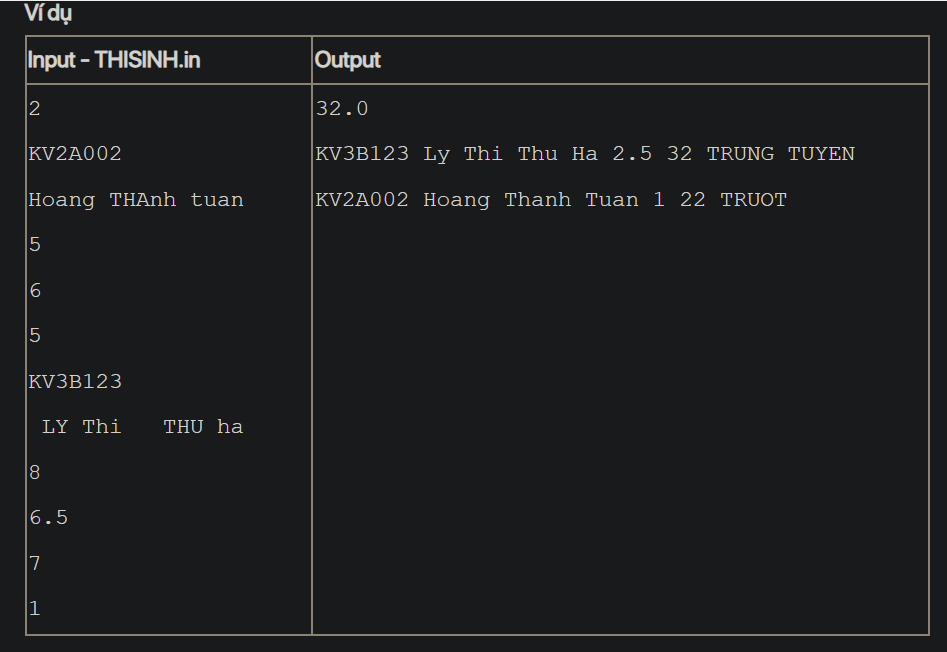

## j07052
## ./j07052

- [CompareByTotalScoreDesc.class](CompareByTotalScoreDesc.class)
- [Contestant.class](Contestant.class)
- [Contestant.java](Contestant.java)
- [image-1.png](image-1.png)
- [image-2.png](image-2.png)
- [image.png](image.png)
- [input.txt](input.txt)
- [j07052.class](j07052.class)
- [j07052.java](j07052.java)
- [output.txt](output.txt)
- [README.md](README.md)
- [THISINH.in](THISINH.in)
