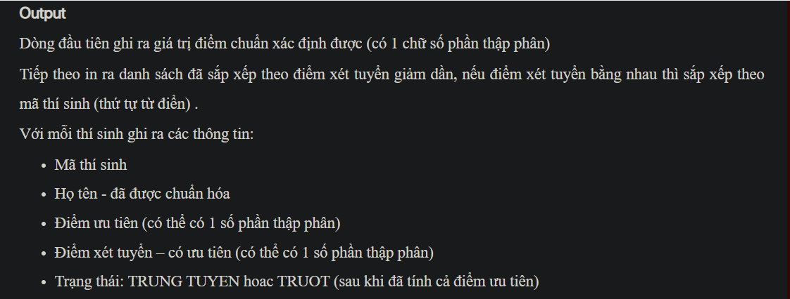

## j07052
## ./j07052




- [CompareByTotalScoreDesc.class](CompareByTotalScoreDesc.class)
- [Contestant.class](Contestant.class)
- [Contestant.java](Contestant.java)
- [image-1.png](image-1.png)
- [image-2.png](image-2.png)
- [image.png](image.png)
- [input.txt](input.txt)
- [j07052.class](j07052.class)
- [j07052.java](j07052.java)
- [output.txt](output.txt)
- [README.md](README.md)
- [THISINH.in](THISINH.in)


### Note
Correct piece of code:
```java
int numPass = Integer.parseInt(input.nextLine());
double lowestPoint = a.get(numPass - 1).getTotalScore();
for (int i = numPass; i < a.size(); i++) {
    if (a.get(i).getTotalScore() == lowestPoint) {
        numPass++;
    } else {
        break;
    }
}
System.out.println(String.format("%.1f", lowestPoint));
for (int i = 0; i < a.size(); i++) {
    if (i < numPass) {
        System.out.println(a.get(i) + " " + "TRUNG TUYEN");
    } else {
        System.out.println(a.get(i) + " " + "TRUOT");
    }
}
```