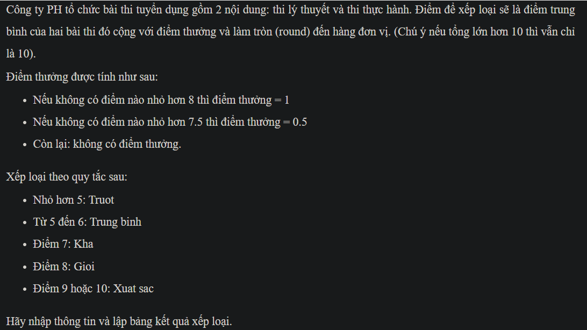
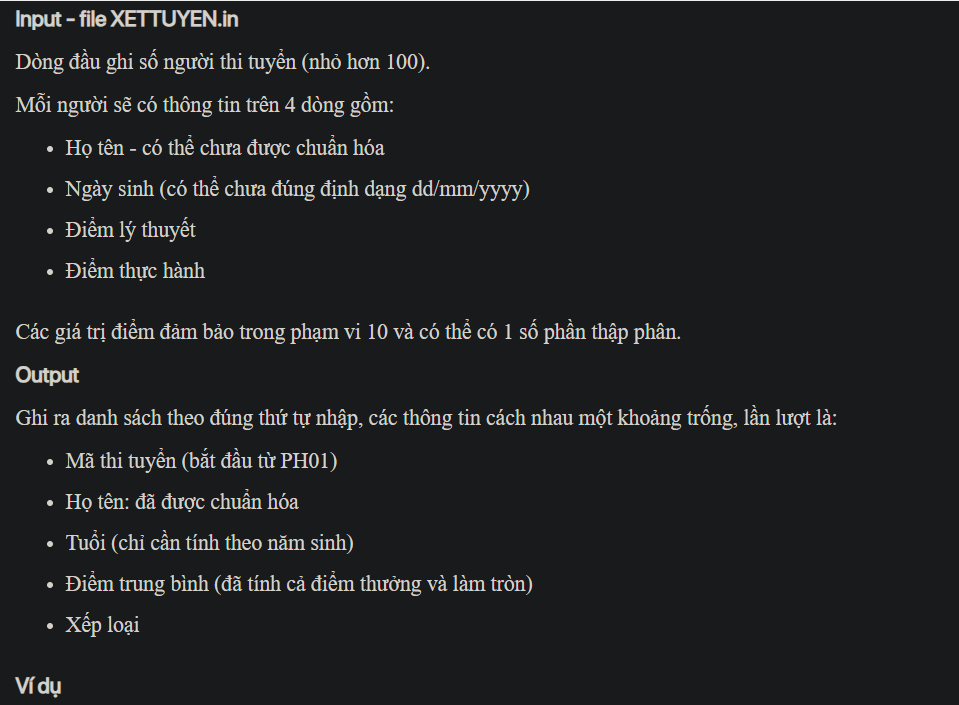
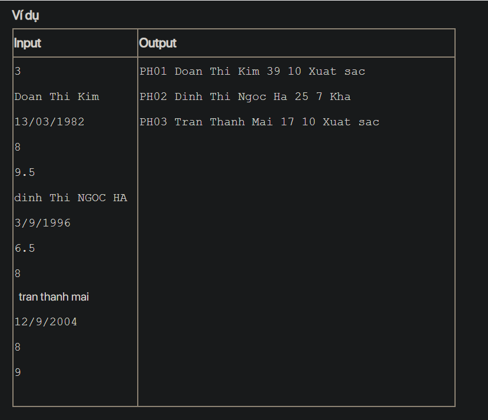

## j07053
## ./j07053

- [Contestant.java](Contestant.java)
- [image-1.png](image-1.png)
- [image-2.png](image-2.png)
- [image.png](image.png)
- [input.txt](input.txt)
- [j07053.java](j07053.java)
- [output.txt](output.txt)
- [README.md](README.md)
- [XETTUYEN.in](XETTUYEN.in)
