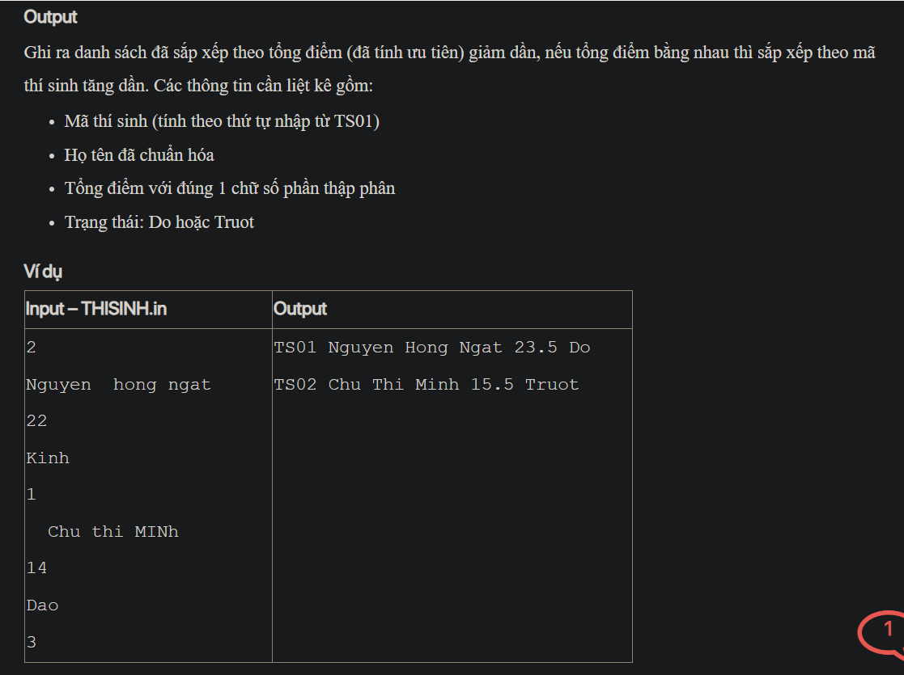

## ./j07057

- [CompareByTotalScoreDescIdAsc.class](CompareByTotalScoreDescIdAsc.class)
- [Contestant.class](Contestant.class)
- [Contestant.java](Contestant.java)
- [input.txt](input.txt)
- [j07057.class](j07057.class)
- [j07057.java](j07057.java)
- [output.txt](output.txt)
- [README.md](README.md)
- [THISINH.in](THISINH.in)
