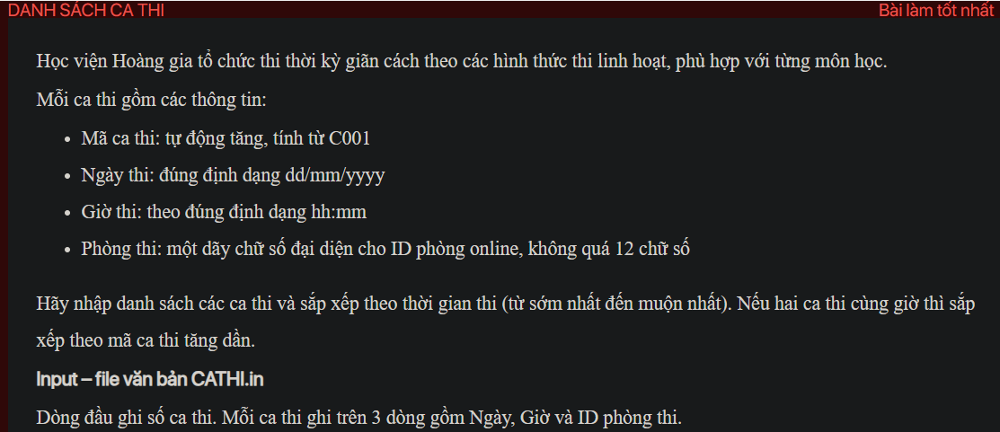
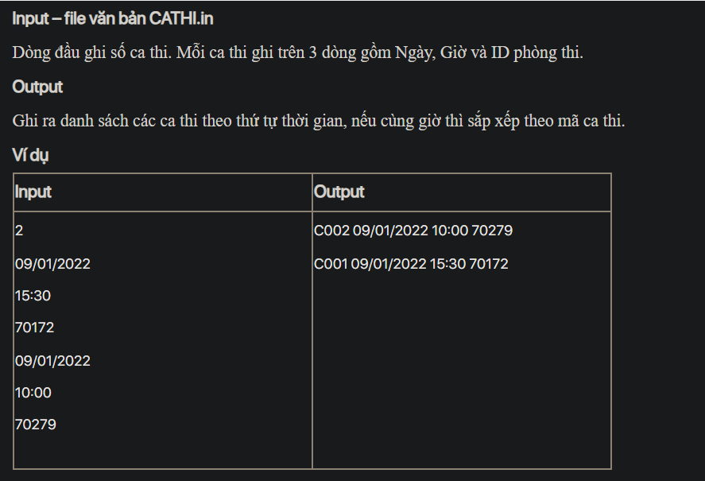

## j07059
## ./j07059

- [CATHI.in](CATHI.in)
- [Date.java](Date.java)
- [image-1.png](image-1.png)
- [image.png](image.png)
- [input.txt](input.txt)
- [j07059.java](j07059.java)
- [output.txt](output.txt)
- [README.md](README.md)
- [TestTime.java](TestTime.java)
- [Time.java](Time.java)
